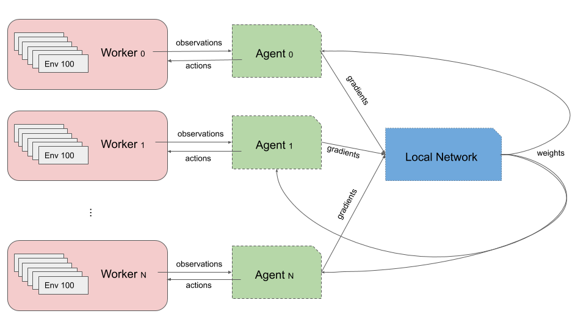

# Distributed-Machine-Learning-with-Ray-Framework

## Requirements
```bash
conda env create -f ray.yml
# tensorflow >= 1.10
# ray >= 0.8.5
# ray[tune]
```

# Architecture


## Training
```bash
(ray) $ python main.py --env_name  "gym_env"\
                       --agent_name "default_agent"\
                       --model_name "ppo" \
                       --num_envs_per_worker 3 \
                       --num_workers 3  \
                       --gpu "0,1,2" \
                       --num_gpus 3 \
                       --num_cpus 8 \
                       --batch_size 10 
```

## Custom usage
- Custom environment. `./envs/custom_env.py`
```python
@register_env('custom_env')
@ray.remote
class CustomEnvWrapper(object):
    def __init__(self, args):
        self.env = "<custom env>"
        ...

    def reset(self):
        # custom operation
        # 1. ob = self.env.reset()
        # 2. return OBSERVATION(...)

    def step(self, action, **kwargs):
        # 1. process the action
        # 2. env.step
        # #observation = self.env.step(action)
        # 3. return OBSERVATION(...)
```

- Custom models. `models/custom_model.py`
```python
@register_model('custom_model')
class CustomModel(object):
    def __init__(self, args):
        ...
        
    @staticmethod
    def add_args(parser):
        # Add customed models arguments
        ...
        
    def step(self, *args, **kwargs):
        ...
        # Compute and return gradients
       
    def choose_actions(self, observation):
        ...
        # Return selected actions (batch)
    
    def get_weights(self):
        # Return weights
        ...
        
    def set_weights(self, weights):
        # Set weights
        ...
```

- Custom agents.
```python
@register_agent("custom_agent")
class DefaultAgent(object):
    def __init__(self, args, model):
        self.model = model
        self.trajectories = []
        ...
    
    @staticmethod
    def add_args(parser):
        """ Add custom arguments here """
        ...
    
    def set_weights(self, weights):
        """ Set weights """
        ...
    
    def send_trajectory(self, trajectory, Rs=None):
        """ Collect trajectories for each worker"""
        ...
    
    def fetch_grads(self, weights):
        """ Compute gradients """
        ...
    
```

- Custom arguments.
Modify `get_custom_args` function in `options/custom_options.py`.

- Run the customized model
```bash
(ray) $ python main.py --env_name  "custom_env"\
                       --agent_name "custom_agent"\
                       --model_name "custom_model" \
                       --num_envs_per_worker 3 \
                       --num_workers 3  \
                       --gpu "0,1,2" \
                       --num_gpus 3 \
                       --num_cpus 8 \
                       --batch_size 10 
                       # custom argument options...
```
